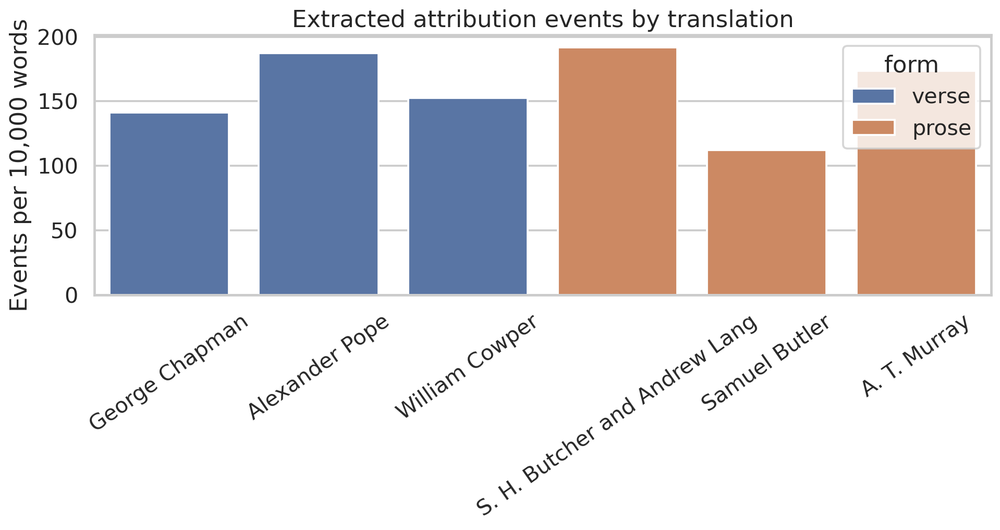
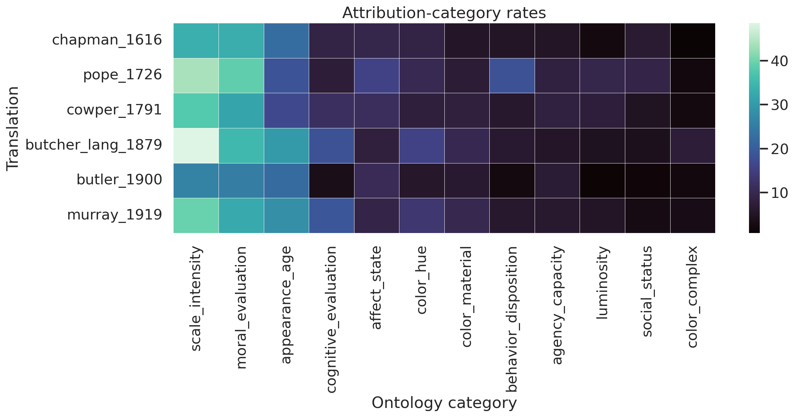
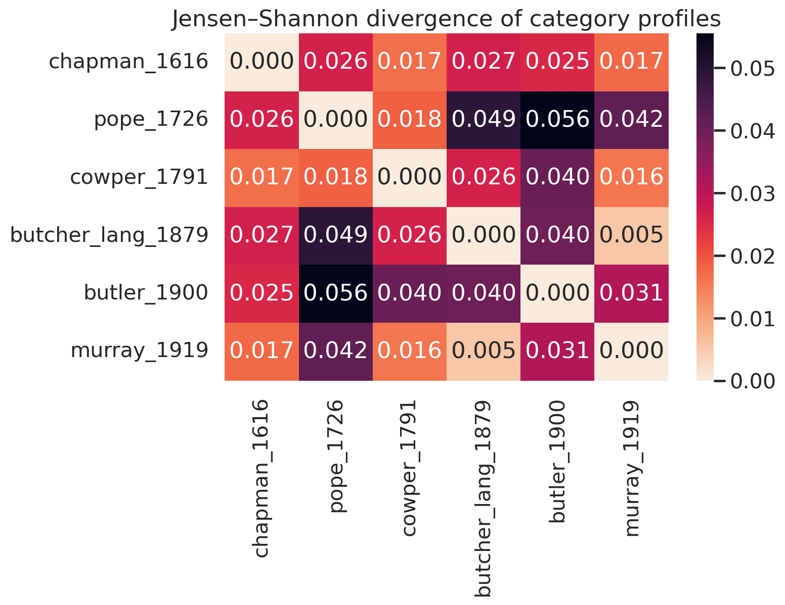
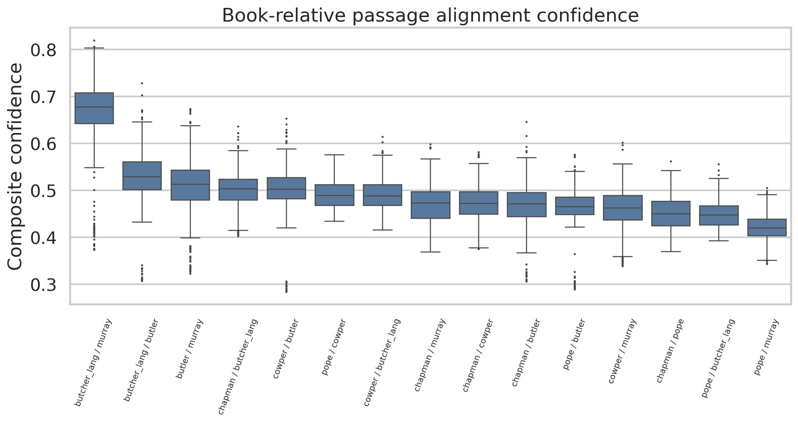
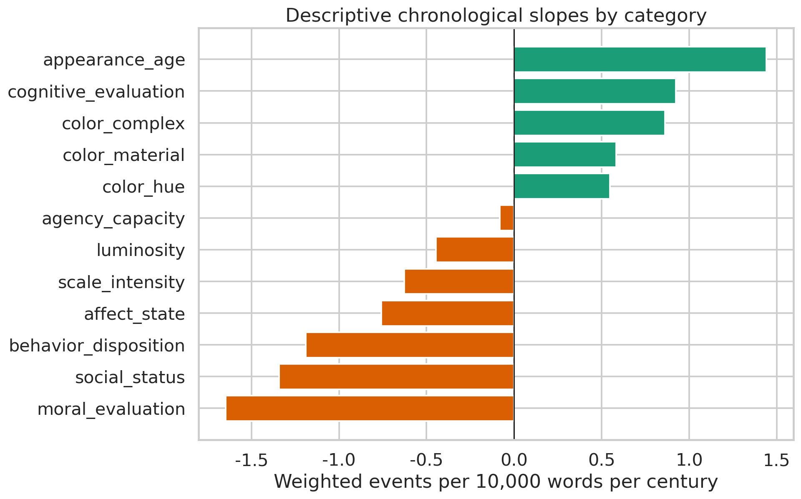
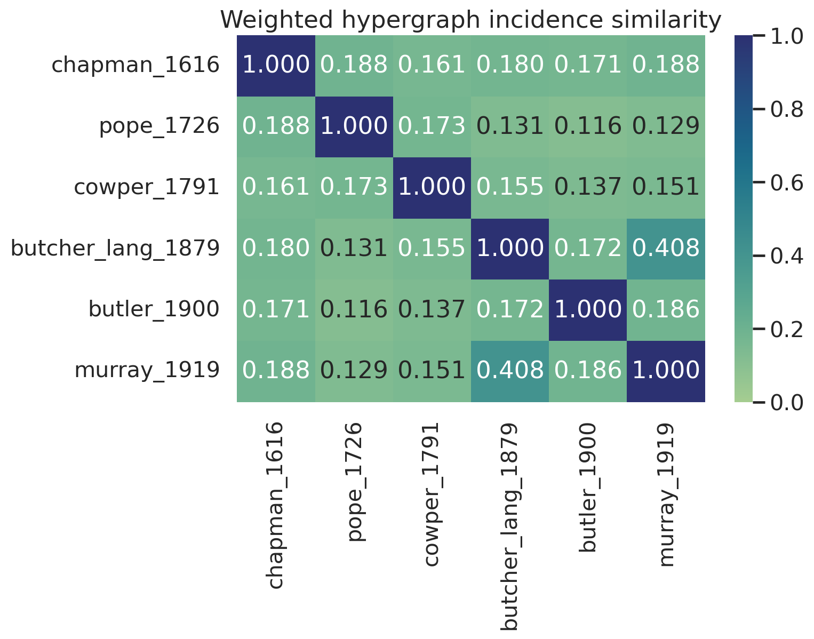
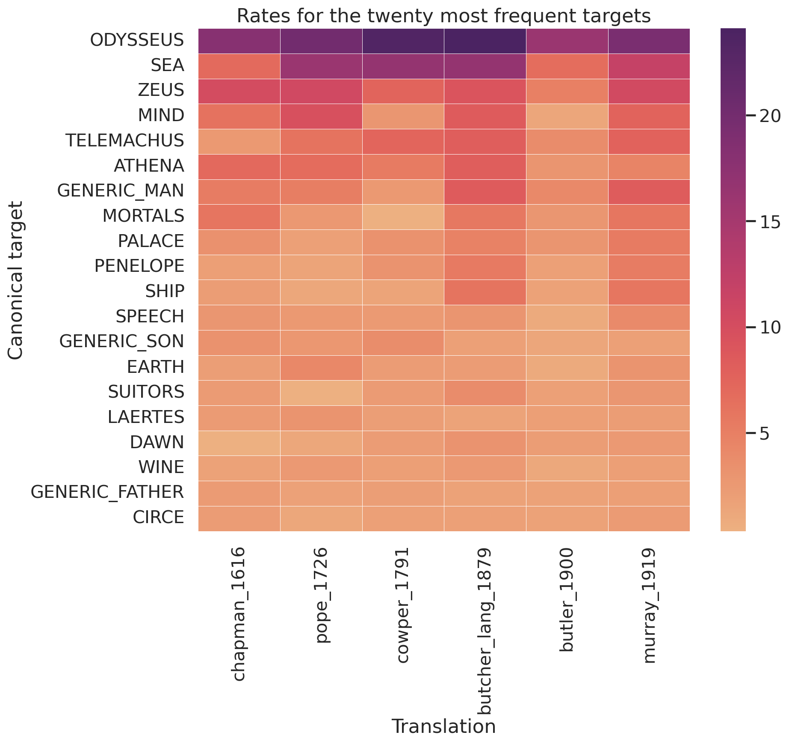

# Attributional Semantics in English Translations of Homer’s *Odyssey*

## Computational Results Report

### Executive statement

This report documents a fully reproducible, rights-safe baseline analysis of **six complete English translations** published from 1616 to 1919. The processed corpus contains **762,798 words** and the explicit extraction grammar identified **12,176 target–attribute events**. Results quantify translation-specific attribution patterns; they do **not** establish a causal ideological evolution because translator, period, verse/prose form, and historical language are confounded.

### Corpus-level diagnostics

| translation_id    | translator                    |   year | form   |   corpus_words |   event_count |   events_per_10k_words |   mean_extraction_confidence |
|:------------------|:------------------------------|-------:|:-------|---------------:|--------------:|-----------------------:|-----------------------------:|
| chapman_1616      | George Chapman                |   1616 | verse  |         138361 |          1952 |                141.08  |                       0.7818 |
| pope_1726         | Alexander Pope                |   1726 | verse  |         111063 |          2080 |                187.281 |                       0.7861 |
| cowper_1791       | William Cowper                |   1791 | verse  |         113783 |          1736 |                152.571 |                       0.7758 |
| butcher_lang_1879 | S. H. Butcher and Andrew Lang |   1879 | prose  |         136111 |          2612 |                191.902 |                       0.8097 |
| butler_1900       | Samuel Butler                 |   1900 | prose  |         126812 |          1424 |                112.292 |                       0.7753 |
| murray_1919       | A. T. Murray                  |   1919 | prose  |         136668 |          2372 |                173.559 |                       0.7131 |

The common alignment coordinate is `(book, relative passage bin)`, yielding 480 matched anchors per translation. It is a deterministic structural alignment, not Greek-line alignment. Murray’s OCR-damaged missing headings are reconstructed between observed anchors using a documented proportional allocation and receive reduced confidence.

The ten weakest anchors are:

| passage_id   |   mean_pairwise_cosine |   mean_length_ratio |   anchor_confidence |
|:-------------|-----------------------:|--------------------:|--------------------:|
| b24_p18      |                 0.0514 |              0.6713 |              0.2994 |
| b24_p14      |                 0.0549 |              0.6713 |              0.3015 |
| b24_p16      |                 0.0616 |              0.671  |              0.3054 |
| b24_p17      |                 0.0639 |              0.672  |              0.3071 |
| b24_p19      |                 0.0642 |              0.6718 |              0.3072 |
| b24_p12      |                 0.0678 |              0.6713 |              0.3092 |
| b24_p20      |                 0.0694 |              0.6713 |              0.3101 |
| b24_p13      |                 0.0697 |              0.6718 |              0.3105 |
| b24_p06      |                 0.0721 |              0.672  |              0.3121 |
| b24_p05      |                 0.0742 |              0.671  |              0.3129 |

### Primary distributional comparisons

The largest category-profile divergences are:

| translation_a     | translation_b   |   year_distance |   jensen_shannon_divergence |   category_cosine_similarity |
|:------------------|:----------------|----------------:|----------------------------:|-----------------------------:|
| butler_1900       | pope_1726       |             174 |                      0.0555 |                       0.9375 |
| butcher_lang_1879 | pope_1726       |             153 |                      0.0494 |                       0.9395 |
| murray_1919       | pope_1726       |             193 |                      0.0417 |                       0.9421 |
| butler_1900       | cowper_1791     |             109 |                      0.0404 |                       0.9551 |
| butcher_lang_1879 | butler_1900     |              21 |                      0.04   |                       0.9569 |
| butler_1900       | murray_1919     |              19 |                      0.031  |                       0.969  |
| butcher_lang_1879 | chapman_1616    |             263 |                      0.0266 |                       0.9762 |
| chapman_1616      | pope_1726       |             110 |                      0.0263 |                       0.9686 |
| butcher_lang_1879 | cowper_1791     |              88 |                      0.0262 |                       0.9692 |
| butler_1900       | chapman_1616    |             284 |                      0.0253 |                       0.9812 |

The analysis uses weighted event counts, where each event is weighted by extraction confidence. Negated predicates receive a 0.5 magnitude multiplier and remain explicitly marked in the event table.

### Chronological estimands

For every ontology category, the pipeline estimates the descriptive slope in weighted events per 10,000 words per century. With only six translations, p-values come from all **720 exact permutations** of publication years. Holm adjustment controls family-wise error across categories. These tests assess chronological ordering under exchangeability; they do not identify ideology.

| category             |   slope_events_per_10k_per_century |   pearson_r_year |   exact_permutation_p |   holm_adjusted_p |
|:---------------------|-----------------------------------:|-----------------:|----------------------:|------------------:|
| social_status        |                            -1.3425 |          -0.8488 |                0.0402 |            0.4827 |
| color_complex        |                             0.8625 |           0.524  |                0.2663 |            1      |
| color_material       |                             0.5841 |           0.5494 |                0.2691 |            1      |
| moral_evaluation     |                            -1.6478 |          -0.4884 |                0.3356 |            1      |
| appearance_age       |                             1.4421 |           0.4465 |                0.3897 |            1      |
| affect_state         |                            -0.7589 |          -0.4319 |                0.3939 |            1      |
| behavior_disposition |                            -1.1903 |          -0.3395 |                0.5479 |            1      |
| cognitive_evaluation |                             0.9234 |           0.2791 |                0.5784 |            1      |
| color_hue            |                             0.5486 |           0.2356 |                0.638  |            1      |
| luminosity           |                            -0.4474 |          -0.225  |                0.6533 |            1      |
| scale_intensity      |                            -0.6275 |          -0.1235 |                0.7822 |            1      |
| agency_capacity      |                            -0.0828 |          -0.1042 |                0.8682 |            1      |

Matched-passage bootstrap intervals resample the 480 common anchors, preserving within-anchor cross-translation dependence:

| category             |   slope_mean |   slope_ci_2_5 |   slope_ci_97_5 |   probability_positive |
|:---------------------|-------------:|---------------:|----------------:|-----------------------:|
| moral_evaluation     |      -1.627  |        -2.518  |         -0.7146 |                  0.002 |
| social_status        |      -1.35   |        -1.739  |         -0.9681 |                  0     |
| behavior_disposition |      -1.1948 |        -1.6461 |         -0.7501 |                  0     |
| affect_state         |      -0.777  |        -1.3481 |         -0.2827 |                  0     |
| scale_intensity      |      -0.6129 |        -1.5777 |          0.3213 |                  0.096 |
| luminosity           |      -0.4464 |        -0.7742 |         -0.1229 |                  0     |
| agency_capacity      |      -0.0855 |        -0.4317 |          0.2567 |                  0.31  |
| color_hue            |       0.5433 |         0.0084 |          1.0972 |                  0.976 |
| color_material       |       0.5941 |         0.1842 |          1.0202 |                  0.998 |
| color_complex        |       0.8663 |         0.6251 |          1.1208 |                  1     |
| cognitive_evaluation |       0.9322 |         0.4128 |          1.4444 |                  1     |
| appearance_age       |       1.4327 |         0.4928 |          2.2636 |                  0.998 |

### Hypergraph comparisons

Each translation is represented as a weighted hypergraph in which canonical **targets are hyperedges** and normalized attributes are vertices. Incidence weights equal summed event confidences. Pairwise comparisons include weighted and unweighted Jaccard similarity, cosine similarity, and mean target-level edge overlap.

| translation_a     | translation_b   |   weighted_jaccard |   incidence_cosine |   unweighted_jaccard |   mean_target_edge_jaccard |
|:------------------|:----------------|-------------------:|-------------------:|---------------------:|---------------------------:|
| butcher_lang_1879 | murray_1919     |             0.4078 |             0.7986 |               0.3825 |                     0.3234 |
| chapman_1616      | pope_1726       |             0.1883 |             0.4832 |               0.2018 |                     0.1335 |
| chapman_1616      | murray_1919     |             0.1882 |             0.482  |               0.2074 |                     0.1482 |
| butler_1900       | murray_1919     |             0.186  |             0.4685 |               0.2039 |                     0.1451 |
| butcher_lang_1879 | chapman_1616    |             0.1796 |             0.4672 |               0.2076 |                     0.1555 |
| cowper_1791       | pope_1726       |             0.1734 |             0.7011 |               0.1782 |                     0.1262 |
| butcher_lang_1879 | butler_1900     |             0.1716 |             0.453  |               0.2083 |                     0.1568 |
| butler_1900       | chapman_1616    |             0.1709 |             0.4392 |               0.1779 |                     0.1228 |
| chapman_1616      | cowper_1791     |             0.1614 |             0.4171 |               0.1874 |                     0.1286 |
| butcher_lang_1879 | cowper_1791     |             0.155  |             0.5001 |               0.1795 |                     0.1202 |
| cowper_1791       | murray_1919     |             0.1506 |             0.3988 |               0.1832 |                     0.1312 |
| butler_1900       | cowper_1791     |             0.1372 |             0.3695 |               0.1603 |                     0.1088 |
| butcher_lang_1879 | pope_1726       |             0.1309 |             0.4657 |               0.1486 |                     0.1011 |
| murray_1919       | pope_1726       |             0.1294 |             0.3853 |               0.1443 |                     0.0969 |
| butler_1900       | pope_1726       |             0.1157 |             0.3851 |               0.1328 |                     0.1021 |

The associated null model permutes attribute labels within each translation, preserving target degrees, attribute frequencies, and event weights. JSON hypergraphs and GraphML target/attribute projections are included under `outputs/hypergraphs/`.

### Memory-bounded contextual semantics

Event contexts are represented with TF–IDF unigrams/bigrams followed by Truncated SVD and L2 normalization. This sparse distributional baseline permits target/category centroid comparisons without loading a transformer on the memory-constrained cloud machine. It is intentionally labeled a baseline; transformer embeddings can be added later under the same event and alignment schema.

### Translation-distinctive attributes

Weighted log-odds-style z scores identify attributes that are comparatively distinctive within each translation. They are exploratory lexical diagnostics, not direct evidence of ideology.

| translation_id    | attribute   |   local_count |   log_odds_ratio |   z_score |
|:------------------|:------------|--------------:|-----------------:|----------:|
| butcher_lang_1879 | evil        |           108 |           1.1291 |    8.7204 |
| butcher_lang_1879 | gray-eyed   |            56 |           3.3208 |    8.5975 |
| butcher_lang_1879 | steadfast   |            52 |           2.111  |    8.5239 |
| butcher_lang_1879 | wise        |           195 |           0.5718 |    6.6095 |
| butcher_lang_1879 | fair        |           186 |           0.5363 |    6.0861 |
| butler_1900       | good        |           129 |           0.8938 |    8.9166 |
| butler_1900       | wicked      |            24 |           2.9697 |    7.7883 |
| butler_1900       | just        |            51 |           1.257  |    7.4871 |
| butler_1900       | old         |           121 |           0.7187 |    7.0771 |
| butler_1900       | young       |            59 |           1.042  |    6.8884 |
| chapman_1616      | free        |            64 |           1.8621 |   10.0865 |
| chapman_1616      | sacred      |            60 |           1.0408 |    6.5513 |
| chapman_1616      | good        |           134 |           0.5564 |    5.6223 |
| chapman_1616      | divine      |            76 |           0.7544 |    5.5905 |
| chapman_1616      | sad         |            36 |           1.1083 |    5.3459 |
| cowper_1791       | deep        |           159 |           1.1221 |   11.6629 |
| cowper_1791       | noble       |            79 |           1.1606 |    8.4162 |
| cowper_1791       | prudent     |            23 |           2.0347 |    6.5571 |
| cowper_1791       | splendid    |            22 |           1.9908 |    6.3536 |
| cowper_1791       | sable       |            25 |           1.7583 |    6.3487 |
| murray_1919       | evil        |           105 |           1.2021 |    9.2587 |
| murray_1919       | beautiful   |            57 |           1.9721 |    9.0901 |
| murray_1919       | wise        |           202 |           0.7572 |    8.8325 |
| murray_1919       | enduring    |            25 |           2.4062 |    6.3457 |
| murray_1919       | bronze      |            47 |           1.1213 |    5.8746 |
| pope_1726         | royal       |            77 |           1.8674 |   10.8522 |
| pope_1726         | faithful    |            41 |           2.5095 |    8.6428 |
| pope_1726         | fierce      |            38 |           1.6133 |    7.0428 |
| pope_1726         | friendly    |            25 |           2.0167 |    6.3942 |
| pope_1726         | bold        |            35 |           1.4295 |    6.2631 |

### Validation and interpretation boundaries

The extraction layer is deliberately auditable. Every event records the surface target and attribute, canonical normalization, ontology category, relation template, token distance, negation, full sentence context, segmentation confidence, and extraction confidence. The package includes a stratified manual-validation sample and annotation template. Automatic estimates should not be interpreted substantively until that sample is reviewed and precision is reported by category, relation template, and translation.

The corpus is appropriate for testing historical translation variation and the computational pipeline. It is not adequate for a 1900–2017 trend claim because only one retained translation is later than 1900. Modern copyrighted translations should be analyzed locally as a governed, non-redistributed extension if lawful access and the applicable text-and-data-mining rules permit.

### Figures

### Reproducibility

Run `make reproduce` from the repository root. The pipeline uses pinned dependencies, deterministic seeds, SHA-256 input/output manifests, and unit/integration tests. Machine-readable data, models, figures, tables, hypergraphs, logs, and this report are all included in the downloadable archive.
